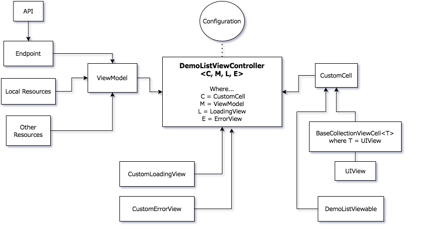

# DemoKit
Because I got tired of copy-pasting code for tests to make a list of items 🤭 😜.

## Description
There was a time in which every time I applied for a job I copied whatever I could from a previous test and use it. But that came to an end... after the fifillionth time. During my career as iOS Developer, copy-pasted code (not mine 😜) made me realise/search/discover patterns to fix it. This time MVVM, my current weapon of choice 🔨, along with one of my favorite Swift features: *Generics* (originally the name of this kit: **GenericKit**). Also, this kit uses *Protocol Associated Types* or *PAT*s to "handshake" all its components. And finally, the reason why it's dependency free, is in case the requirement of the Demo App is *not* to use external libraries. This way I had to write everything from scratch and learn a couple of things.

## Overview


## Usage examples
Putting these pieces together, obviously.\
:warning: &nbsp; Might not be 100% accurate to the actual code due to updates.

### ViewController

```swift
class MyViewController: DemoListViewController<MyCell, MyViewModel, MyLoadingView, MyErrorView> {

    override func configure() {
        configuration.isPaginated = true
        configuration.itemsPerPage = 30
        configuration.itemsPerRow = 3
    }
}
```

### ViewModel

```swift
class MyViewModel: DemoListViewModel {
    typealias Model = MyModel

    required init() {}
    
    func getItems(filter: DemoListFilter, 
        @escaping success: DemoListResult, 
        @escaping failure: DemoListError) {
        // get data from somewhere, filter, offset, etc.
        // return an array of arrays of MyModel
        success([[MyModel]])
        // ...
        // or fail
        failure(ErrorType)
    }
}
```

### Endpoint (optional)

```swift
class MyEndpoint: <T: EndpointResponse>: Endpoint<T> {
    
    override init(url: String,
                  method: Endpoint<T>.Method = .get,
                  headers: Endpoint<T>.Headers = [:],
                  parameters: Endpoint<T>.Parameters = [:]) {
        
        var params = Parameters()
        params["someParam"] = someVar

        super.init(url: url, method: method, headers: headers, parameters: params)
    }
}
```

```swift
class MyResponse: EndpointResponse {
    typealias Model = MyModel
    
    var items: [MyModel] = []
    
    required init(data: Data) {
        // process, parse data
        items = processedData
    }
}
```

### CollectionViewCell

```swift

class MyCell: BaseCollectionViewCell<MyCellView>, DemoListViewable {
    typealias Model = MyModel

    func configure(with model: Model) {
        view?.myProperty = model.property
        // ...
    }
```

<br />

## MARVEL's Demo
Check out my [MARVEL's Demo](/MarvelDemo) list of Characters to know more about the details of implementation. This Pod and the Demo are ready to download and build too.

### More Demos/tests
To see more of my old code tests [ask me](mailto:victormarcias@gmail.com) for an invite to my private **tests** repo.

<br />

## More Code
To see more of my code just check my other repositories in my [Github](https://github.com/victormarcias).

Thanks for reading! (not many do 🤭)
